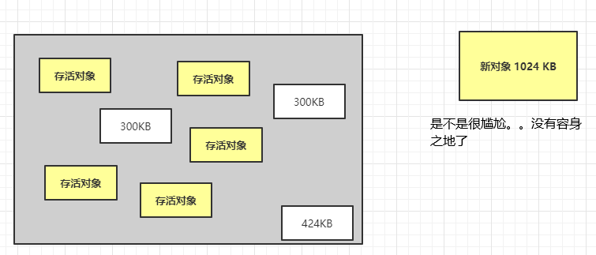
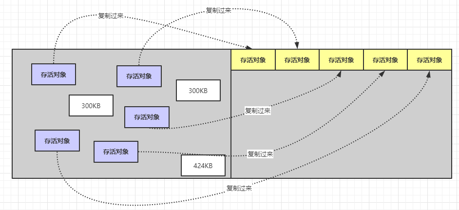
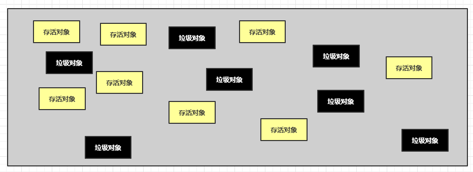
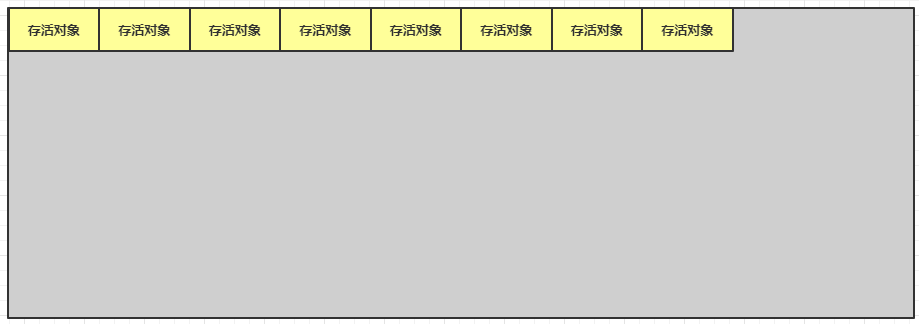

# JVM有哪些垃圾回收算法？

# 典型回答
### 标记-清除
标记清除是最简单和干脆的一种垃圾回收算法，他的执行流程是这样子的：当 JVM 识别出内存中的垃圾以后，直接将其清除，但是这样有一个很明显的缺点，就是会导致内存空间的不连续，也就是会产生很多的内存碎片。先画个图来看下

我们使用上图左边的图来表示垃圾回收之前的样子，黑色的区域表示可以被回收的垃圾对象。这些对象在内存空间中不是连续的。右侧这张图表示是垃圾回收过后的内存的样子。可以很明显的看到里面产生了断断续续的 内存碎片。

> 那说半天垃圾不是已经被回收了吗？内存碎片就内存碎片呗。又能咋地？
>

好，我来这么告诉你，现在假设这些内存碎片所占用的空间之和是1 M，现在新创建了一个对象大小就是 1 M，但是很遗憾的是，此时内存空间虽然加起来有 1 M，但是并不是连续的，所以也就无法存放这大对象。也就是说这样势必会造成内存空间的浪费，这就是内存碎片的危害。

> 比方说其中的1M空间其实依然是可用的，只不过它只能存放<=1M的对象，但是再出现大小完全一模一样的对象是概率很低的事情，即使出现了也并不一定被刚好分配到这段空间上，所以这1M很大概率会被分配给一个<1M的对象，或许只会被利用999K或者1020K或者任意K，剩下的那一点点就很难再被利用了，这才形成了碎片。
>

这么一说标记-清除就没有优点了吗？优点还是有的：速度快

到此，我们来对标记-清除来做一个简单的优缺点小结：

+ 优点
    - 速度快，因为不需要移动和复制对象
+ 缺点
    - 会产生内存碎片，造成内存的浪费

### 
### 标记-复制
上面的清除算法真的太差劲了。都不管后来人能不能存放的下，就直接啥也不管的去清除对象。所以升级后就来了复制算法。

复制算法的工作原理是这样子的：首先将内存划分成两个区域。新创建的对象都放在其中一块内存上面，当快满的时候，就将标记出来的存活的对象复制到另一块内存区域中（注意：这些对象在在复制的时候其内存空间上是严格排序且连续的），这样就腾出来一那一半就又变成了空闲空间了。依次循环运行。

在回收前将存活的对象复制到另一边去。然后再回收垃圾对象，回收完就类似下面的样子：

如果再来新对象被创建就会放在右边那块内存中，当内存满了，继续将存活对象复制到左边，然后清除掉垃圾对象。

标记-复制算法的明显的缺点就是：浪费了一半的内存，但是优点是不会产生内存碎片。所以我们再做技术的时候经常会走向一个矛盾点地方，那就是：一个新的技术的引入，必然会带来新的问题。

到这里我们来简单小结下标记-复制算法的优缺点：

+ 优点
    - 内存空间是连续的，不会产生内存碎片
+ 缺点
    - 1、浪费了一半的内存空间
    - 2、复制对象会造成性能和时间上的消耗

说到底，似乎这两种垃圾回收回收算法都不是很好。而且在解决了原有的问题之后，所带来的新的问题也是无法接受的。所以又有了下面的垃圾回收算法。

### 标记-整理
标记-整理算法是结合了上面两者的特点进行演化而来的。具体的原理和执行流程是这样子的：我们将其分为2个阶段：

第一阶段为标记；

第二阶段为整理；

标记：它的第一个阶段与标记-清除算法是一模一样的，均是遍历 GC Roots，然后将存活的对象标记。

整理：移动所有存活的对象，且按照内存地址次序依次排列，然后将末端内存地址以后的内存全部回收。因此，第二阶段才称为整理阶段。

我们是画图说话，下面这张图是垃圾回收前的样子。

下图图表示的第一阶段：标记出存活对象和垃圾对象

白色空间表示被清理后的垃圾。

下面就开始进行整理：

可以看到，现在即没有内存碎片，也没有浪费内存空间。

但是这就完美了吗？他在标记和整理的时候会消耗大量的时间（微观上）。但是在大厂那种高并发的场景下，这似乎有点不尽如人意。

到此，我们将标记-整理的优缺点整理如下：

+ 优点
    - 1、不会产生内存碎片
    - 2、不会浪费内存空间
+ 缺点
    - 太耗时间（性能低）

到此为止，我们已经了知道了标记-清除、标记-复制、标记-整理三大垃圾回收算法的优缺点。

**单纯的从时间长短上面来看：标记-清除 < 标记-复制 < 标记-整理。**

****

**单纯从结果来看：标记-整理 > 标记-复制 >= 标记-清除**

> 原文: <https://www.yuque.com/hollis666/xkm7k3/sinedm>