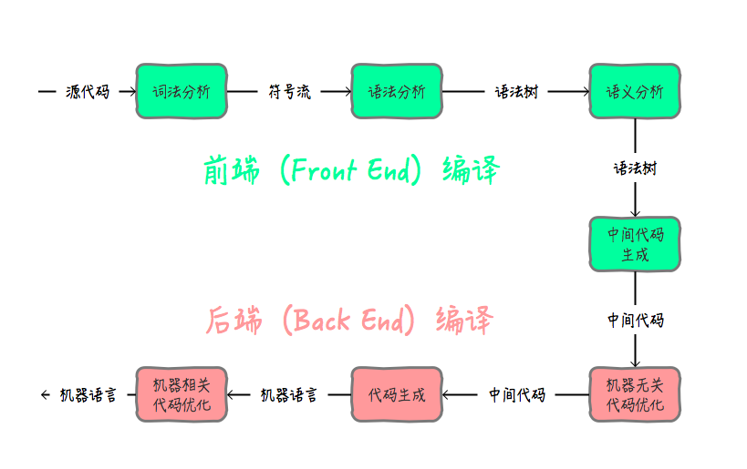

# 什么是编译和反编译？

# 典型回答


编程语言（Programming Language）分为低级语言（Low-level Language）和高级语言（High-level Language）。


机器语言（Machine Language）和汇编语言（Assembly Language）属于低级语言，直接用计算机指令编写程序。


而C、C++、Java、Python等属于高级语言。**低级语言是计算机认识的语言、高级语言是程序员认识的语言。**


**将便于人编写、阅读、维护的高级计算机语言所写作的源代码程序，翻译为计算机能解读、运行的低阶机器语言的程序的过程就是编译**。负责这一过程的处理的工具叫做编译器。


我们可以通过javac命令将Java程序的源代码编译成Java字节码，即我们常说的class文件。这是我们通常意义上理解的编译。但是，字节码并不是机器语言，要想让机器能够执行，还需要把字节码翻译成机器指令。这个过程是Java虚拟机做的，这个过程也叫编译。是更深层次的编译。


在编译原理中，把源代码翻译成机器指令，一般要经过以下几个重要步骤：




**我们可以把将.java文件编译成.class的编译过程称之为前端编译。把将.class文件翻译成机器指令的编译过程称之为后端编译。**


**反编译的过程与编译刚好相反，就是将已编译好的编程语言还原到未编译的状态，也就是找出程序语言的源代码。**就是将机器看得懂的语言转换成程序员可以看得懂的语言。Java语言中的反编译一般指将class文件转换成java文件。


# 扩展知识
## 反编译工具


介绍3个Java的反编译工具：javap、jad和cfr

### javap


[javap命令的作用是什么？](https://www.yuque.com/hollis666/xkm7k3/xz23fep6vq62x5hm)

### jad
jad是一个比较不错的反编译工具，只要下载一个执行工具，就可以实现对class文件的反编译了。还是上面的源代码，使用jad反编译后内容如下：

命令：jad switchDemoString.class

```plain
public class switchDemoString
{
    public switchDemoString()
    {
    }
    public static void main(String args[])
    {
        String str = "world";
        String s;
        switch((s = str).hashCode())
        {
        default:
            break;
        case 99162322:
            if(s.equals("hello"))
                System.out.println("hello");
            break;
        case 113318802:
            if(s.equals("world"))
                System.out.println("world");
            break;
        }
    }
}
```

看，这个代码你肯定看的懂，因为这不就是标准的java的源代码么。这个就很清楚的可以看到原来字符串的switch是通过equals()和hashCode()方法来实现的。

但是，jad已经很久不更新了，在对Java7生成的字节码进行反编译时，偶尔会出现不支持的问题，在对Java 8的lambda表达式反编译时就彻底失败。

### CFR
jad很好用，但是无奈的是很久没更新了，所以只能用一款新的工具替代他，CFR是一个不错的选择，相比jad来说，他的语法可能会稍微复杂一些，但是好在他可以work。

如，我们使用cfr对刚刚的代码进行反编译。执行一下命令：

```plain
java -jar cfr_0_125.jar switchDemoString.class --decodestringswitch false
```

得到以下代码：

```plain
public class switchDemoString {
    public static void main(String[] arrstring) {
        String string;
        String string2 = string = "world";
        int n = -1;
        switch (string2.hashCode()) {
            case 99162322: {
                if (!string2.equals("hello")) break;
                n = 0;
                break;
            }
            case 113318802: {
                if (!string2.equals("world")) break;
                n = 1;
            }
        }
        switch (n) {
            case 0: {
                System.out.println("hello");
                break;
            }
            case 1: {
                System.out.println("world");
                break;
            }
        }
    }
}
```

通过这段代码也能得到字符串的switch是通过equals()和hashCode()方法来实现的结论。

相比Jad来说，CFR有很多参数，还是刚刚的代码，如果我们使用以下命令，输出结果就会不同：

```plain
java -jar cfr_0_125.jar switchDemoString.class

public class switchDemoString {
    public static void main(String[] arrstring) {
        String string;
        switch (string = "world") {
            case "hello": {
                System.out.println("hello");
                break;
            }
            case "world": {
                System.out.println("world");
                break;
            }
        }
    }
}
```

所以--decodestringswitch表示对于switch支持string的细节进行解码。类似的还有--decodeenumswitch、--decodefinally、--decodelambdas等。在我的关于语法糖的文章中，我使用--decodelambdas对lambda表达式警进行了反编译。 源码：

```plain
public static void main(String... args) {
    List<String> strList = ImmutableList.of("Hollis", "公众号：Hollis", "博客：www.hollischuang.com");

    strList.forEach( s -> { System.out.println(s); } );
}
```

java -jar cfr_0_125.jar lambdaDemo.class --decodelambdas false反编译后代码：

```plain
public static /* varargs */ void main(String ... args) {
    ImmutableList strList = ImmutableList.of((Object)"Hollis", (Object)"\u516c\u4f17\u53f7\uff1aHollis", (Object)"\u535a\u5ba2\uff1awww.hollischuang.com");
    strList.forEach((Consumer<String>)LambdaMetafactory.metafactory(null, null, null, (Ljava/lang/Object;)V, lambda$main$0(java.lang.String ), (Ljava/lang/String;)V)());
}

private static /* synthetic */ void lambda$main$0(String s) {
    System.out.println(s);
}
```

CFR还有很多其他参数，均用于不同场景，读者可以使用java -jar cfr_0_125.jar --help进行了解。这里不逐一介绍了。


## 如何防止反编译
由于我们有工具可以对Class文件进行反编译，所以，对开发人员来说，如何保护Java程序就变成了一个非常重要的挑战。但是，魔高一尺、道高一丈。当然有对应的技术可以应对反编译咯。但是，这里还是要说明一点，和网络安全的防护一样，无论做出多少努力，其实都只是提高攻击者的成本而已。无法彻底防治。

典型的应对策略有以下几种：

+ 隔离Java程序
    - 让用户接触不到你的Class文件
+ 对Class文件进行加密
    - 提到破解难度
+ 代码混淆
    - 将代码转换成功能上等价，但是难于阅读和理解的形式


> 原文: <https://www.yuque.com/hollis666/xkm7k3/gpd672xz0sx2qyyh>