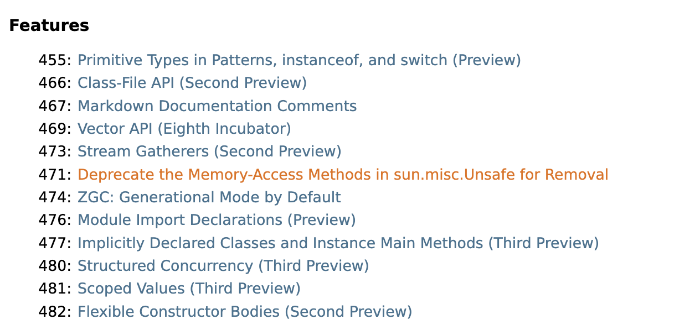

# 什么是Unsafe？

# 典型回答


Unsafe是CAS的核心类。**因为Java无法直接访问底层操作系统，而是通过本地（native）方法来访问。不过尽管如此，JVM还是开了一个后门，JDK中有一个类Unsafe，它提供了硬件级别的原子操作。**


Unsafe是Java中一个底层类，包含了很多基础的操作，比如数组操作、对象操作、内存操作、CAS操作、线程(park)操作、栅栏（Fence）操作，JUC包、一些三方框架都使用Unsafe类来保证并发安全。


Unsafe类在jdk 源码的多个类中用到，这个类的提供了一些绕开JVM的更底层功能，基于它的实现可以提高效率。但是，它是一把双刃剑：正如它的名字所预示的那样，它是Unsafe的，它所分配的内存需要手动free（不被GC回收）。Unsafe类，提供了JNI某些功能的简单替代：确保高效性的同时，使事情变得更简单。


Unsafe类提供了硬件级别的原子操作，主要提供了以下功能：

1、通过Unsafe类可以分配内存，可以释放内存；

2、可以定位对象某字段的内存位置，也可以修改对象的字段值，即使它是私有的；

3、将线程进行挂起与恢复

4、CAS操作


# 扩展知识


## 被移除


Unsafe 在JDK 23中即将被移除（本文更新时 JDK23尚未发布正式版），主要是因为他本来就不是一个给开发者用的 API，而是为了给 JDK 自己用的，用它可以随意的处理堆内和堆外内存，非常不安全，所以要被移除了。





替代方案是JDK 9中的VarHandle和 JDK 22中的MemorySegment


# 举例


<font style="color:rgb(74, 74, 74);">Unsafe 被设计的初衷，并不是希望被一般开发者调用，它的构造方法是私有的，所以我们不能通过 new 或者工厂方法去实例化 Unsafe 对象，通常可以采用反射的方法获取到 Unsafe 实例：</font>

<font style="color:rgb(74, 74, 74);"></font>

```java
Field theUnsafeField = Unsafe.class.getDeclaredField("theUnsafe");
        theUnsafeField.setAccessible(true);
        Unsafe unsafe = (Unsafe) theUnsafeField.get(null);
```


> Unsafe中提供了一个静态的getUnsafe方法，可以返回一个unsafe的实例，但是这个只有在Bootstrap类加载器中可以使用，否则会抛出SecurityException
>

## 分配内存


unsafe中提供了allocateMemory方法来分配堆外内存，freeMemory方法来释放堆外内存。


```java
import sun.misc.Unsafe;
import java.lang.reflect.Field;

public class UnsafeExample {
    public static void main(String[] args) throws NoSuchFieldException, IllegalAccessException {
        // 使用反射获取Unsafe实例
        Field theUnsafeField = Unsafe.class.getDeclaredField("theUnsafe");
        theUnsafeField.setAccessible(true);
        Unsafe unsafe = (Unsafe) theUnsafeField.get(null);

        // 分配堆外内存，返回内存地址
        long size = 1024; // 内存大小
        long address = unsafe.allocateMemory(size);

        // 写入数据到堆外内存
        String dataToWrite = "Hello, this is hollis testing direct memory!";
        byte[] dataBytes = dataToWrite.getBytes();
        for (int i = 0; i < dataBytes.length; i++) {
            unsafe.putByte(address + i, dataBytes[i]);
        }

        // 从堆外内存读取数据
        byte[] dataToRead = new byte[dataBytes.length];
        for (int i = 0; i < dataBytes.length; i++) {
            dataToRead[i] = unsafe.getByte(address + i);
        }

        System.out.println(new String(dataToRead));

        // 释放堆外内存
        unsafe.freeMemory(address);
    }
}


输出结果：Hello, this is hollis testing direct memory!
```


## CAS操作


使用Unsafe也可以实现一个CAS操作：


```java
import sun.misc.Unsafe;
import java.lang.reflect.Field;

public class CASExample {
    private static Unsafe unsafe;

    static {
        try {
            // 使用反射获取Unsafe实例
            Field theUnsafeField = Unsafe.class.getDeclaredField("theUnsafe");
            theUnsafeField.setAccessible(true);
            unsafe = (Unsafe) theUnsafeField.get(null);
        } catch (NoSuchFieldException | IllegalAccessException e) {
            e.printStackTrace();
        }
    }

    private static class Counter {
        private volatile int value;

        public Counter(int initialValue) {
            this.value = initialValue;
        }

        // CAS操作
        public void increment() {
            int current;
            int next;
            do {
                current = value;
                next = current + 1;
            } while (!unsafe.compareAndSwapInt(this, valueOffset, current, next));
        }
    }

    // 获取value字段在Counter对象中的偏移量
    private static final long valueOffset;

    static {
        try {
            valueOffset = unsafe.objectFieldOffset(Counter.class.getDeclaredField("value"));
        } catch (NoSuchFieldException e) {
            throw new Error(e);
        }
    }

    public static void main(String[] args) throws InterruptedException {
        Counter counter = new Counter(0);

        // 创建多个线程并发更新计数器
        Thread[] threads = new Thread[10];
        for (int i = 0; i < threads.length; i++) {
            threads[i] = new Thread(() -> {
                for (int j = 0; j < 1000; j++) {
                    counter.increment();
                }
            });
            threads[i].start();
        }

        // 等待所有线程完成
        for (Thread thread : threads) {
            thread.join();
        }

        // 输出最终计数值
        System.out.println("Final counter value: " + counter.value);
    }
}


输出结果：Final counter value: 10000

```


> 原文: <https://www.yuque.com/hollis666/xkm7k3/prx4n1mxtbk8qffq>