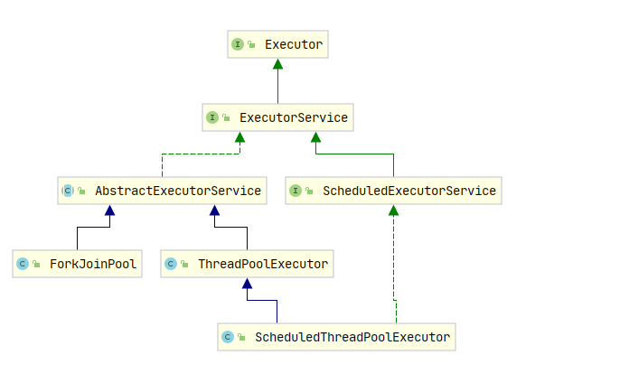
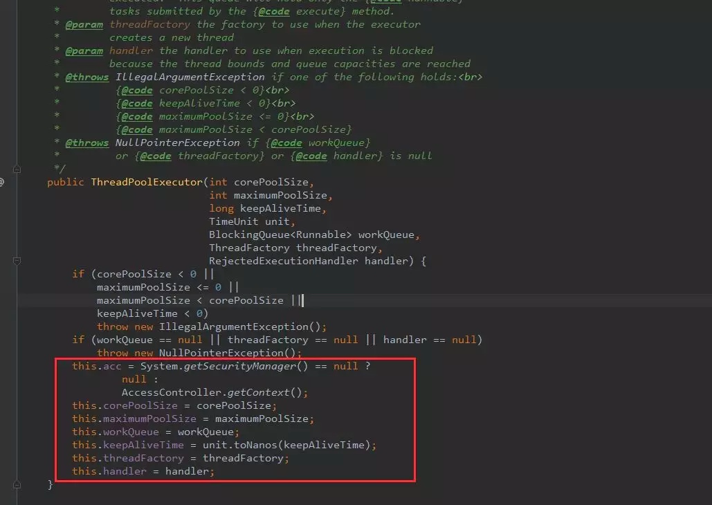
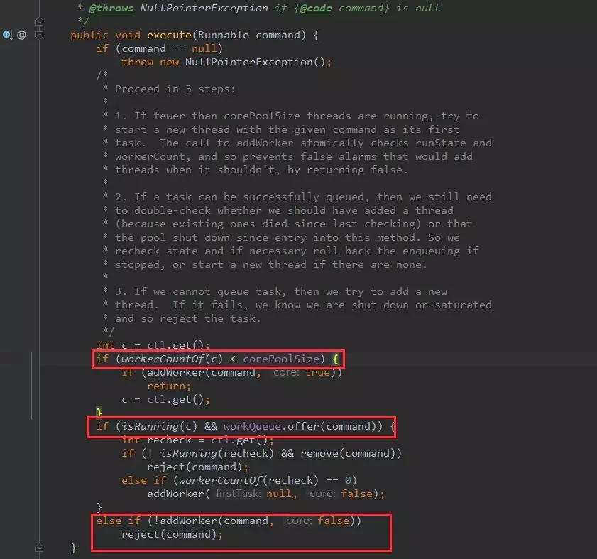
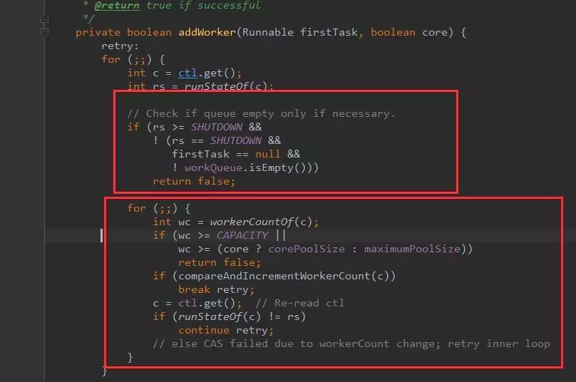
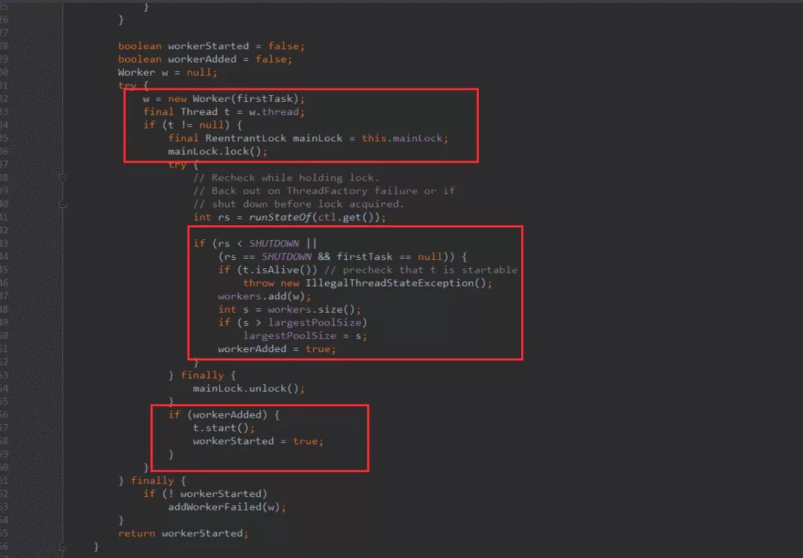
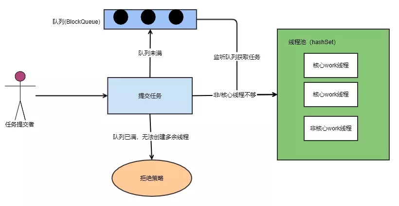

# 什么是线程池，如何实现的？

# 典型回答

线程池是池化技术的一种典型实现，所谓池化技术就是提前保存大量的资源，以备不时之需。在机器资源有限的情况下，使用池化技术可以大大的提高资源的利用率，提升性能等。

线程池，说的就是提前创建好一批线程，然后保存在线程池中，当有任务需要执行的时候，从线程池中选一个线程来执行任务。

在编程领域，比较典型的池化技术有：

线程池、连接池、内存池、对象池等。

Java中线程池的继承关系如下：

# 扩展知识

## Executors

Executors的创建线程池的方法，创建出来的线程池都实现了ExecutorService接口。常用方法有以下几个：

newFixedThreadPool(int Threads)：创建固定数目线程的线程池。

newCachedThreadPool()：创建一个可缓存的线程池，调用execute 将重用以前构造的线程（如果线程可用）。如果没有可用的线程，则创建一个新线程并添加到池中。终止并从缓存中移除那些已有 60 秒钟未被使用的线程。

newSingleThreadExecutor()创建一个单线程化的Executor。

newScheduledThreadPool(int corePoolSize)创建一个支持定时及周期性的任务执行的线程池，多数情况下可用来替代Timer类。

## 线程池的实现原理

通常，一般构造函数会反映出这个工具或这个对象的数据存储结构。

> 如果把线程池比作一个公司。公司会有正式员工处理正常业务，如果工作量大的话，会雇佣外包人员来工作。
>
>  
>
> 闲时就可以释放外包人员以减少公司管理开销。一个公司因为成本关系，雇佣的人员始终是有最大数。
>
>  
>
> 如果这时候还有任务处理不过来，就走需求池排任务。
>

+  acc : 获取调用上下文 
+  corePoolSize: 核心线程数量，可以类比正式员工数量，常驻线程数量。 
+  maximumPoolSize: 最大的线程数量，公司最多雇佣员工数量。常驻+临时线程数量。 
+  workQueue：多余任务等待队列，再多的人都处理不过来了，需要等着，在这个地方等。 
+  keepAliveTime：非核心线程空闲时间，就是外包人员等了多久，如果还没有活干，解雇了。 
+  threadFactory: 创建线程的工厂，在这个地方可以统一处理创建的线程的属性。每个公司对员工的要求不一样，恩，在这里设置员工的属性。 
+  handler：线程池拒绝策略，什么意思呢？就是当任务实在是太多，人也不够，需求池也排满了，还有任务咋办？默认是不处理，抛出异常告诉任务提交者，我这忙不过来了。 

### 添加一个任务

接着，我们看一下线程池中比较重要的execute方法，该方法用于向线程池中添加一个任务。

核心模块用红框标记了。 * 第一个红框：workerCountOf方法根据ctl的低29位，得到线程池的当前线程数，如果线程数小于corePoolSize，则执行addWorker方法创建新的线程执行任务；

+  第二个红框：判断线程池是否在运行，如果在，任务队列是否允许插入，插入成功再次验证线程池是否运行，如果不在运行，移除插入的任务，然后抛出拒绝策略。如果在运行，没有线程了，就启用一个线程。 
+  第三个红框：如果添加非核心线程失败，就直接拒绝了。 

这里逻辑稍微有点复杂，画了个流程图仅供参考

接下来，我们看看如何添加一个工作线程的？

### 添加worker线程

从方法execute的实现可以看出：addWorker主要负责创建新的线程并执行任务，代码如下（这里代码有点长，没关系，也是分块的，总共有5个关键的代码块）：

+ 第一个红框：做是否能够添加工作线程条件过滤：

判断线程池的状态，如果线程池的状态值大于或等SHUTDOWN，则不处理提交的任务，直接返回；

+ 第二个红框：做自旋，更新创建线程数量：

通过参数core判断当前需要创建的线程是否为核心线程，如果core为true，且当前线程数小于corePoolSize，则跳出循环，开始创建新的线程

> 有人或许会疑问 retry 是什么？这个是java中的goto语法。只能运用在break和continue后面。
>

接着看后面的代码：

+ 第一个红框：获取线程池主锁。

线程池的工作线程通过Woker类实现，通过ReentrantLock锁保证线程安全。

+  第二个红框：添加线程到workers中（线程池中）。 
+  第三个红框：启动新建的线程。 

接下来，我们看看workers是什么。

一个hashSet。所以，线程池底层的存储结构其实就是一个HashSet。

### worker线程处理队列任务

+  第一个红框：是否是第一次执行任务，或者从队列中可以获取到任务。 
+  第二个红框：获取到任务后，执行任务开始前操作钩子。 
+  第三个红框：执行任务。 
+  第四个红框：执行任务后钩子。 

这两个钩子（beforeExecute，afterExecute）允许我们自己继承线程池，做任务执行前后处理。

到这里，源代码分析到此为止。接下来做一下简单的总结。

### 总结

所谓线程池本质是一个hashSet。多余的任务会放在阻塞队列中。

只有当阻塞队列满了后，才会触发非核心线程的创建。所以非核心线程只是临时过来打杂的。直到空闲了，然后自己关闭了。

线程池提供了两个钩子（beforeExecute，afterExecute）给我们，我们继承线程池，在执行任务前后做一些事情。

线程池原理关键技术：锁（lock,cas）、阻塞队列、hashSet（资源池）

> 原文: <https://www.yuque.com/hollis666/xkm7k3/fb5th6>