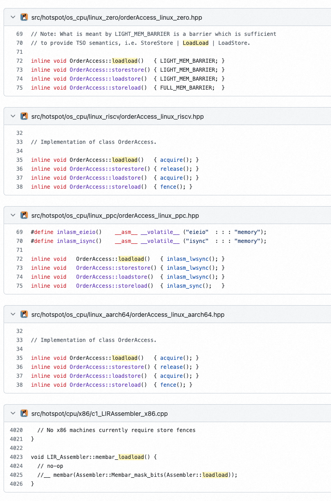

# 到底啥是内存屏障？到底怎么加的？

# 典型回答


（无关紧要的话：这个问题也困扰了我好久，之前一直没深究，毕竟这东西离开发太远了，但是最近在volatile的介绍中有很多人问这个东西到底是咋加的，还有的兄弟说我介绍的根本不对，那我就抽空研究了一下，和大家一起学习。但是本文的内容太底层了，我个人觉得了解即可。。。）


为了保证volatile变量的可见性和禁止指令重排序，Java会在生成的字节码中插入内存屏障来实现。


我们所说的内存屏障是一种CPU指令，它可以防止CPU及编译器对指令序列进行重排序，从而保证在代码执行过程中，对内存的读写操作按照程序员的意愿来进行。


关于内存屏障，推荐看一下，Doug Lea写的这篇文章：[https://gee.cs.oswego.edu/dl/jmm/cookbook.html](https://gee.cs.oswego.edu/dl/jmm/cookbook.html)


### 四种屏障


volatile变量的内存屏障是通过一组指令来实现的，包括LoadLoad、LoadStore、StoreStore和StoreLoad。这些指令用于保证在volatile变量的读取和写入操作中，相邻指令之间的顺序不会被改变。


1. **LoadLoad**：`Load1; LoadLoad; Load2`，确保 <font style="background-color:#E7E9E8;">Load1</font> 加载数据先于 <font style="background-color:#E7E9E8;">Load2 和所有后续加载指令</font>。
2. **LoadStore**：`Load1; LoadStore; Store2`，确保 <font style="background-color:#E7E9E8;">Load1</font> 的数据加载先于 <font style="background-color:#E7E9E8;">Store2 及其后续存储指令将数据刷新到主内存</font>。
3. **StoreStore**：`<font style="color:rgb(55, 65, 81);">Store1; StoreStore; Store2</font>`，确保 <font style="background-color:#E7E9E8;">Store1</font> 的数据在<font style="background-color:#E7E9E8;">Store2 及所有后续存储指令相关的数据</font>之前对其他处理器可见（即刷新到内存中）
4. **StoreLoad**：`Store1; StoreLoad; Load2`，确保 <font style="background-color:#E7E9E8;">Store1</font> 的数据在 <font style="background-color:#E7E9E8;">Load2 及其后续加载指令访问的数据</font>之前对其他处理器可见（即刷新到主内存）


> 这里怎么记呢，就看操作顺序就行了，先load再load，中间加的就是LoadLoad，先Load再Store，中间加的就是LoadStore
>


但是，Doug Lea也说过，《很难找到一个” 最佳” 的位置使得最大限度地减少执行屏障的总数》，并且在不同的操作系统上，具体的添加屏障的情况也不一致，有些操作系统可以天然保证一些操作不会被重排序。


那么，如果严格一点的话，最完整的情况应该是这样加内存屏障，对于volatile变量来说：


+ 在每一个volatile的写(store)之前，加入一个StoreStore屏障和一个LoadStore屏障
+ 在每一个volatile的写(store)之后，加入一个StoreLoad屏障和一个StroeStore屏障
+ 在每一个volatile的读(load)之后，加一个LoadLoad屏障和LoadStrore屏障


即：


```plain
StoreStore
LoadStore

store

StoreLoad
StroeStore

-----


load

LoadLoad
LoadStrore
```

<font style="color:rgb(255, 0, 0);background-color:rgb(255, 255, 238);"></font>

以上定义可以在JDK的MemoryBarriers.java中找到：


但是这只是最严格的情况，在不同的操作系统上面，具体实现方式也不尽相同，这几个内存屏障被定义在[orderAccess.hpp](https://github.com/openjdk/jdk/blob/28c82bf18d85be00bea45daf81c6a9d665ac676f/src/hotspot/share/runtime/orderAccess.hpp)中。而且在实际实现时，肯定是能尽可能少的加屏障最好了。


```plain
class OrderAccess : public AllStatic {
 public:
  // barriers
  static void     loadload();
  static void     storestore();
  static void     loadstore();
  static void     storeload();

  static void     acquire();
  static void     release();
  static void     fence();
}
```


不同操作系统有自己不同的实现：


> no-op表示不需要任何操作，操作系统已经天然支持的内存屏障保障。
>
> acq，表示acquire，表示内存屏障只不允许其后面的读写向前越过屏障，挡后不挡前;
>
> rel，表示release，表示内存屏障只不允许其前面的读写向后越过屏障，挡前不挡后；
>
> stlr 的全称是 store release register，包括 StoreStore barrier 和 LoadStore barrier（场景少），通常使用 release 语义将寄存器的值写入内存；
>
> ldar 的全称是 load acquire register，包括 LoadLoad barrier 和 LoadStore barrier（对，你没看错，我没写错），通常使用 acquire 语义从内存中将值加载入寄存器；
>
> 
>
> （这个我觉得不需要被，也不太用关注，只不过注意一下这里的release和acquire等操作就行了，因为看JDK源码的时候，会有响应的代码）
>
> 所以，只需要记住：
>
> 
>
> <font style="color:#DF2A3F;">acquire 相当于在 Load 后面加上 LoadLoad，LoadStore </font>
>
> <font style="color:#DF2A3F;">release 其实相当于在 Store 前面加上 LoadStore 和 StoreStore</font>
>


那对应到代码实现上，可以在JDK中找到很多具体实现。



### X86实现


再贴一下图，免得往前翻了，重点看X86这行


比如我们看下X86的实现：orderAccess_windows_x86.hpp、orderAccess_linux_x86.hpp等中这几个方法的实现：


```plain
inline void OrderAccess::loadload()   { compiler_barrier(); }
inline void OrderAccess::storestore() { compiler_barrier(); }
inline void OrderAccess::loadstore()  { compiler_barrier(); }
inline void OrderAccess::storeload()  { fence(); }

inline void OrderAccess::acquire()    { compiler_barrier(); }
inline void OrderAccess::release()    { compiler_barrier(); }
```


可以看到，针对X86天然支持的loadload、storestore、loadstore这里没有针对CPU做什么特殊的操作，只是调用编译器屏障的代码了。


而对于需要处理的storeload，这里单独做了一个实现（以下是orderAccess_windows_x86的实现）。


```plain
inline void OrderAccess::fence() {
#ifdef AMD64
  StubRoutines_fence();
#else
  __asm {
    lock add dword ptr [esp], 0;
  }
#endif // AMD64
  compiler_barrier();
}
```


### ARM实现


再贴一下图，免得往前翻了，重点看ARM这行：


然后再对照着代码：orderAccess_linux_arm.hpp


```plain
inline void OrderAccess::loadload()   { dmb_ld(); }
inline void OrderAccess::loadstore()  { dmb_ld(); }
inline void OrderAccess::acquire()    { dmb_ld(); }
inline void OrderAccess::storestore() { dmb_st(); }
inline void OrderAccess::storeload()  { dmb_sy(); }
inline void OrderAccess::release()    { dmb_sy(); }
inline void OrderAccess::fence()      { dmb_sy(); }
```


可以看到不同的方法是采用不同的方式实现的。


### 总结


内存屏障，主要是为了防止CPU及编译器的指令重排的，因为不同的CPU对于内存屏障的支持和实现都不一样，所以在JDK中，虽然定义了四种屏障，但是在具体加屏障过程中可能并不完全一样。


如果严格来说，那么保证一定不出问题，那么就是在volatile变量的，store前面添加StoreStore、LoadStore；在store后面添加StoreLoad和StoreStore，在load后面添加LoadLoad、LoadStore。


但是，加太多屏障也会影响性能，因为指令重排也是一个重要的性能优化手段，所以，在实际实现中可能会做一些优化，减少屏障数量，比如X86中，在操作系统上，就只需要针对StoreLoad加屏障。


> 原文: <https://www.yuque.com/hollis666/xkm7k3/kozqs205honv8nso>